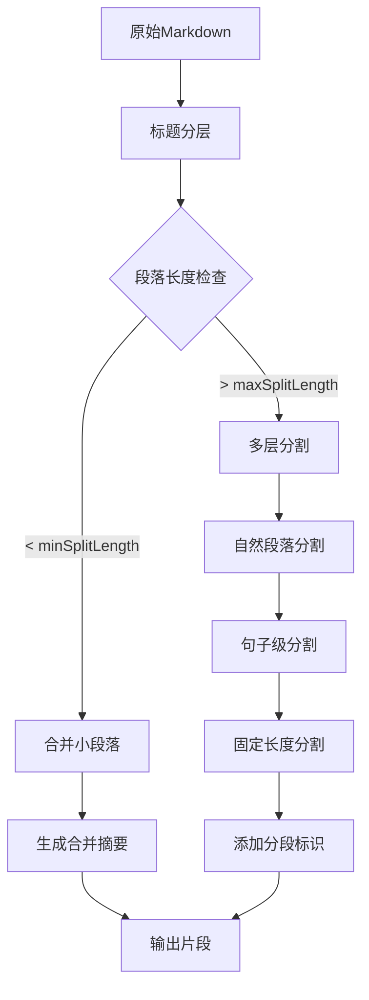

基于代码中的实现，Markdown文档的分割策略可以总结为以下核心步骤：

策略如下：

首先，我们根据Markdown的标题将文档分割成多个部分（sections），每个部分包含一个标题及其后续内容（直到下一个同级或更高级别标题为止）。
然后，我们对每个部分进行进一步处理，确保每个段落的长度在指定的最小值和最大值之间。
如果某个部分的长度小于最小分割长度（minSplitLength），我们会尝试将其与后续的小段落合并，直到合并后的长度达到最小分割长度或超过最大分割长度（maxSplitLength）。
如果某个部分的长度超过最大分割长度，我们需要进一步分割：
首先尝试按两个连续的换行（即段落）进行分割。
如果分割后仍有段落超过最大长度，则尝试按句子分割（使用句子结束标点分割）。
如果单个句子仍然超过最大长度，则按固定长度（maxSplitLength）进行分割。
对于分割后的每个段落，我们生成一个摘要（summary），用于描述该段落的内容。摘要的生成会考虑该段落的标题层次结构（即目录大纲）。
具体到代码中的两个函数：

splitLongSection(section, maxSplitLength):

输入：一个段落对象（包含内容content）和最大分割长度。
处理：将段落内容按两个连续的换行符分割成多个小段落（paragraphs）。
然后遍历这些小段落，并尝试组合它们，使得每个块（chunk）不超过maxSplitLength。
如果某个小段落本身超过maxSplitLength，则进一步按句子分割，如果句子还超过最大长度，则按固定长度分割。
processSections(sections, outline, minSplitLength, maxSplitLength):

输入：由解析器得到的段落数组（每个段落包含标题、级别、内容等）、目录大纲、最小和最大分割长度。
步骤：
a. 预处理：合并相邻的小段落（即长度小于minSplitLength的段落），但合并后不能超过maxSplitLength。
b. 使用一个accumulatedSection变量来累积多个小段落，直到累积的内容长度达到minSplitLength（但不超过maxSplitLength）才生成一个段落。
c. 对于超过maxSplitLength的段落，调用splitLongSection进行分割。
d. 对于每个生成的段落（无论是合并后的还是分割后的），生成一个摘要（通过调用generateEnhancedSummary函数）。
e. 处理完所有段落后，检查是否还有累积的小段落，如果有则尝试与上一个段落合并（如果合并后不超过maxSplitLength）或单独作为一个段落（如果不超过maxSplitLength）添加。
注意：在生成摘要时，我们考虑了段落的标题层次（headings），包括在合并段落时多个标题的保留。

另外，在分割过程中，我们尽量保持段落的语义完整性（比如按段落分割，再按句子分割），避免在句子中间或单词中间分割。

但是，如果单个句子长度超过maxSplitLength，我们只能按固定长度分割（这种情况应该较少，比如很长的代码块或URL等）。

最后，返回一个数组，每个元素包含摘要（summary）和内容（content）。


### 1. **基础分段策略**
- **标题分层**：根据Markdown标题层级(`#`到`######`)将文档划分为逻辑段落
- **内容划分**：每个段落包含：
  - 标题文本（heading）
  - 标题层级（level）
  - 内容（content）
  - 位置信息（position）

### 2. **段落合并策略**
- **小段落合并**：
  - 当段落长度小于`minSplitLength`时
  - 优先尝试与相邻小段落合并
  - 合并后内容长度不超过`maxSplitLength`
- **标题保留**：
  ```javascript
  // 合并时保留原段落标题
  mergedContent = `${currentSection.content}\n\n${section.heading ? 
                  `${'#'.repeat(section.level)} ${section.heading}\n` : ''}${section.content}`
  ```

### 3. **大段落分割策略**
- **分层分割流程**：
  1. 先按空行分割成自然段落
  2. 再按句子结束符分割（`[.!?。！？]`）
  3. 最后按固定长度分割（兜底策略）
- **分段逻辑**：
  ```javascript
  // 三级分割实现
  if (paragraph.length > maxSplitLength) {
    // 1. 按句子分割
    const sentenceSplit = paragraph.match(/[^.!?。！？]+[.!?。！？]+/g) || [paragraph];
    
    // 2. 句子级合并
    for (const sentence of sentenceSplit) {
      if ((chunk + sentence).length <= maxSplitLength) {
        // 合并到当前块
      } else {
        // 3. 超长句子按固定长度切分
        for (let i = 0; i < sentence.length; i += maxSplitLength) {
          result.push(sentence.substr(i, maxSplitLength));
        }
      }
    }
  }
  ```

### 4. **边界处理策略**
- **分段标记**：
  - 添加分段编号（`Part X/Y`）
  - 保留原层级标题结构
- **摘要生成**：
  ```javascript
  // 生成带分段信息的摘要
  generateEnhancedSummary(section, outline, segmentIndex, totalSegments)
  // 输出示例: "章节标题 - Part 2/5"
  ```

### 5. **特殊场景处理**
- **末尾段落处理**：
  - 优先尝试与前一段落合并
  - 合并后超长则单独成段
- **纯内容段落**：
  - 无标题段落直接进入分割流程
- **标题继承**：
  ```javascript
  // 分割后段落继承原标题信息
  section.headings = [{ heading: section.heading, level: section.level }]
  ```

### 6. **摘要生成策略
- **层级感知**：根据标题层级生成结构化摘要
- **分段标识**：添加`Part X/Y`分段标记
- **内容浓缩**：基于目录大纲提取核心信息

### 处理流程图


这个策略实现了：
1. 保持Markdown的语义结构（标题层级）
2. 动态处理不同长度的内容区块
3. 生成带结构信息的摘要
4. 处理边缘情况（超长句子/末尾段落）
5. 通过分段标识保持内容连续性